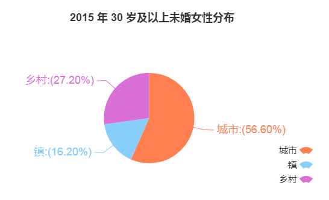

# 宝藏女孩

成员：车子，李林，卢燕

教练：朱九爷

## 第一章 剩女面面观

### 1. 剩女的定义

剩女，是教育部 2007 年 8 月公布的 171 个汉语新词之一。

广义的 “剩女” 是从年龄上界定的大龄未婚女性； 而狭义上的 “剩女” 则是指所谓的高学历、 高收入、 高智商（简称“三高”）的未婚女性 （李美景， 2012）。 

对“大龄” 的界定：根据陈友华和吕程 （2011） 的界定方法， “剩女” 可以理解为超过社会所认为的适宜或最佳结婚年龄而仍然没有结婚的人， 而平均年龄可以作为衡量这一结婚年龄的指标。 假设男女初婚年龄呈正态分布（实际上呈偏正态分布）， 平均值为 μ， 标准差为 σ， 则 “剩女” 的年龄界定下限设定为 μ＋σ。

截至2015年，上海男女的平均初婚年龄分别为 30.3 岁和 28.4 岁，比 2005 年分别提高了 5.0 岁和 5.4 岁。

 所以，剩女的年龄下限至少是 30+，本文主要讨论 30-34 岁的未婚女性。

### 2. 剩女人数的增多

各年龄组，未婚女性的百分比如下表：

| 年龄组 | 1995 | 2000 | 2010  | 2015  |
| ------ | ---- | ---- | ----- | ----- |
| 25-29  | 5.5  | 8.67 | 21.62 | 26.92 |
| 30-34  | 0.8  | 1.35 | 5.35  | 6.95  |
| 35-39  | 0.3  | 0.51 | 1.76  | 2.29  |

（数据来源: 《1995 年全国 1%人口抽样调查资料》《中国 2000 年人口普查资料》《中国 2010 年人口普查资料》《2015 年全国 1%人口抽样调查资料》）

数据来源：[渐行渐近的人口危机——中国生育报告2019（六）]( http://www.cnpop.org/study/viewpoint/201901/00006012.html )

### 3. 未婚女性的城乡分布

**结论：剩女主要在城市**

2010 年 30 岁及以上未婚女性在城市、建制镇、乡村的分布分别为 49.4%、14.3%、36.3%，2015 年变成56.6%、16.2%、27.2%。

2015 年城市 30 岁及以上女性未婚率为 2.4%，明显超过建制镇的 1.0%、农村的 0.9%。

数据来源：[渐行渐近的人口危机——中国生育报告2019（六）]( http://www.cnpop.org/study/viewpoint/201901/00006012.html )

### 4. 未婚女性的文化程度分布

**结论：女性学历越高，越容易“剩”**

除了城乡女性差异，学历差异也很明显，高学历女性未婚化现象上升较大。2000年和2010年比较，受过高中及以上教育的女性未婚率均高于十年前，其中2010年全国研究生学历全部年龄段女性近一半未婚，未婚率较十年前高出13.96个百分点。随着大量女性具有较高的学历和知识素养，女人拥有了更多工作机会，在财富创造上的生产力一点都不低于男性，更加注重追求自身价值的实现，而减轻了对婚姻家庭的依附。 

 

下表数据来源：2010 年人口普查，2015 年全国 1%人口抽样调查

| 2015年   | 女性人口 | 未婚女人口 | 未婚率 |
| -------- | -------- | ---------- | ------ |
| 未上过学 | 775911   | 11778      | 1.52%  |
| 小学     | 2031015  | 30338      | 1.49%  |
| 初中     | 3278223  | 347848     | 10.61% |
| 高中     | 1048026  | 343612     | 32.79% |
| 专科     | 635378   | 257788     | 40.57% |
| 本科     | 557829   | 296749     | 53.20% |
| 研究生   | 52528    | 26083      | 49.66% |

| 2010年   | 女性人口 | 未婚女人口 | 未婚率 |
| -------- | -------- | ---------- | ------ |
| 未上过学 | 4883458  | 69431      | 1.42%  |
| 小学     | 13817336 | 405345     | 2.93%  |
| 初中     | 20961802 | 3842584    | 18.33% |
| 高中     | 7660597  | 3017798    | 39.39% |
| 大学专科 | 3073160  | 1275007    | 41.49% |
| 本科     | 2016689  | 1018997    | 50.53% |
| 研究生   | 185751   | 91321      | 49.16% |

| 2010年   | 30-34岁的女性 | 30-34岁的未婚女性 | 未婚率 |
| -------- | ------------- | ----------------- | ------ |
| 未上过学 | 61516         | 5739              | 9.33%  |
| 小学     | 691189        | 24134             | 3.49%  |
| 初中     | 2344197       | 95788             | 4.09%  |
| 高中     | 689862        | 48984             | 7.10%  |
| 大专     | 391030        | 33004             | 8.44%  |
| 本科     | 253878        | 25322             | 9.97%  |
| 研究生   | 35765         | 6254              | 17.49% |

### 5. 反常识点：剩女不是女性人口过剩

**结论： “剩女”问题，不在两性数量的失衡，而是在婚姻市场中的结构性不匹配。** 

从数量上说，“剩女”是一个建构失效的伪命题，以下数据表明**各年龄组和受教育程度下的女性均处于短缺状态**。

### 6. 剩女的成因

1. 社会层面：择偶梯度（由社会学家巴纳德提出）

   择偶梯度理论指男性倾向于选择与自己社会地位相当或者比自己地位稍差的女 性为伴侣，而与此相反，女性往往更多地要求配偶在受教育、薪金收入和职业阶层等方面高于自己，也就是婚姻中常说的“男高女低”的模式。

   （参考论文：张溢. 教育是否妨碍了女性的婚姻[D].清华大学,2012.）

   

2. 经济层面：

   + 女性经济地位上升
   + 高离婚率

     

   

   

   图片来源：[2017中国婚姻人口数据分析、离婚率十强城市及离婚主要原因分析]( https://www.chyxx.com/industry/201709/564406.html )

   

3. 意识形态：个人主义、女权主义、家庭功能弱化

## 第二章 单身也能活得好

“单身经济”这一概念，源自西方经济学家 F.T. McCarthy 2001 年在《经济学人》上最早提出的“单身女性经济”概念。

### 1. 一个人也要好好吃饭

一个人照样能吃得好。

一人食原本是发源于日本的一种就餐方式，讲究一人一锅一隔间，互不干扰的模式。国内慢慢火热，专为一人打造一人食谱。

《一人食》电影

国内比较知名的一人食连锁店

国内海底捞——一个人吃饭，也能享受美味。

一兰拉面

针对单身外卖
“三分饱”
杭州餐饮界“排队餐厅”代表新白鹿，上线了“一人吃好”一人食外卖
“上线20天，销量突破5万份；30天，突破10万份。”新白鹿团队透露，去年12月7日“一人吃好外卖节”，单日销量最高突破6000份，其中鱼香茄子烩巴沙鱼片饭就卖出了1497份。
一些外卖品牌便是以此形式推出“一人食”服务，比如丰收日、湘小递、和记小菜等
2018年的相关数据显示，有35.3%的外卖订单，是因为需要单独用餐。而从单身群体点外卖的频率来看，有超过60%的人，每周点外卖至少3次。

### 2. 一个人的安乐窝

拥有一个属于自己安乐小窝，是越来越多单身女性的选择。

提取2018年全年贝壳找房二手房交易数据，共计67724条数据，数据经过脱敏处理；调研数据，通过在线调研，
共回收约964份有效问卷，其中目标群体问卷量为440份，周期为2019年03月01日-2019年03月13日。
**城市维度**
12个城市，分别是北京、深圳、上海、杭州、南京、武汉、重庆、合肥、郑州、长沙、苏州、西安
定义北京、上海、深圳为一线城市，其他为二线城市
**年龄划分**
大龄女青年：30岁及以上及50岁以下年龄段女性购房者

贝壳发布的《单身租客调查报告》显示，针对占比超七成的单身租客，国内有房地产商开发出了10平方米左右的“超迷你”单身公寓，甚至深圳有商家推出了6平方米精装的极致小户公寓。

**迷你家电**

2018年迷你微波炉和迷你洗衣机购买人数分别增长973%和630%，180升以下的迷你冰箱购买人数增长33.33%；

### 3. 单身也快乐（迷你 KTV、一人旅行）

第一财经商业数据中心(CBNData)联合口碑发布了《2018生活消费趋势报告》
2015年的电影《小森林》里，女主市子在乡间自给自足地烹制料理的生活也让不少都市人直呼“向往”。
日本漫画家高木直子在她的作品《一个人住的第5年》、《一个人住的第9年》里细数了一个人生活的点点滴滴。

另据淘票票和灯塔专业版联合发布的数据显示，将近三成的95后购买“单身票”观影，其中一线城市“单身”观影率达到34%；不仅如此，今年“七夕”一个人在携程上报团旅游的人数同比增长48%，大大超过情侣报团旅行的增长率。

### 4. 单身不孤独

“一日男友”、“叫起床”、“陪聊天”等等服务。

猫狗宠物

一个人可以好好养一只宠物陪伴自己，一起哭，一起笑，一起压马路，一起跑步。

《2019年中国宠物行业白皮书》数据显示，2019年中国城镇宠物(犬猫)消费市场突破2000亿的关卡，整体消费规模达到2024亿元，比2018年增长18.5%。
来源：[https://m.pedaily.cn/news/447028](https://m.pedaily.cn/news/447028)

### 5. 给单身提个醒

记得买保险，抵御未知风险。

## 第三章 脱单秘籍

### 1. 常见的脱单方法

单身人士结识异性最常选择的渠道是亲友/同事介绍，其次是婚恋交友平台

### 2. 亲友介绍

亲友/同事介绍，在剩女中成功率低，原因：总量小，通常我们的朋友圈相对我们的活动圈是小很多的，朋友推荐的也就是朋友的没有对象的朋友通常都不多，以至于可以筛选的就很少，再加上剩女一般年龄偏大，周围已婚人士居多，朋友的朋友圈中也更偏已婚人士。

### 3. 婚恋平台

#### 3.1 婚恋平台现状

#### 3.2 婚恋平台存在的问题

1. 匹配度低：用户信息过于模式化，呈现过于同一，个性化不足；向全社会的单身用户开放
2. 用户互动不足，一般婚恋平台查看信息都需要付费
3. 骗子多：杀猪盘，查找投诉数据验证 [@todo](https://github.com/todo)

https://zhuanlan.zhihu.com/p/39798871

#### 3.3 增加婚恋成功率：婚恋平台新模式

- 精准匹配：
  参考：
  1. 美剧《黑镜》第四季中的《HangTheDJ》一集，描述了一个AI约会App
  2.《Kingpin : How One Hacker Took Over the Billion-Dollar Cybercrime Underground》

> 这是一件发生在大约两年前的故事，在通过聚类算法分析了洛杉矶2万女性的600万个OkCupid（可以理解为美国的世纪家园）问题的答案以后，35岁的数学家Chris McKinlay开始用程序以每天1000个人的速度给与他高匹配的女性组发送个人简介，最后在约会到第88次后，向28岁的Tien Wang求婚，找到了真爱。[# 一个数学系高材生的约会大作战](https://36kr.com/p/209357)

- 提高互动：直播+婚恋、游戏+婚恋

> 事实上，婚恋交友作为最需要诚意和展现真实精神面貌的社交活动，引入直播模式只是时间问题。一方面，直播的实时性和互动性为传统的线上婚恋交友注入了新的血液，在过去发布文字和图片的基础上，用户通过开通自己的视频直播间，向异性展示自己的才华、才艺，也可以通过别人的直播进一步增进了解。同时直播也进一步增婚恋平台的婚恋相亲真实性，使得用户的体验得到不断的提升和完善。 https://cloud.tencent.com/developer/article/1136452

- 可信任度：细分群体，加强验证：单身青年自救平台

### 4. 走进单身男性多的圈子，增加概率

#### 4.1 *从社会网络的理论引出*[@todo](https://github.com/todo)

程度中心性：简单地说，某点的程度中心性就是与它相连的线条数；

中介中心性：社会网络分析基于网络信息的流通性提出了中介中心性概念，它是指某一个体在多大程度上承担个体间媒介作用的中心性评估指标，其基本计算方法是计算其他个体相互联系时有多少条关系是通过该个体的。个体的中介中心性越高，需要通过他发生联系的人就越多，该个体所能得到的信息也就越多，其操纵信息流通的能力也就越大。

亲近中心性：亲近中心性是依据网络中各节点间的紧密性程度或距离而进行测量的中心性指标，其基本的计算方法是将某一节点与其他节点间的距离加和后求倒数。个体的亲近中心性越高，则其与其他个体的距离越近，在整体中就越处于核心位置，传递信息或实施行为时就越少依赖他人。亲近中心性直观反映了个体在群体中的位置，即是处在中心位置还是边缘位置。

三元闭包： 在一个社交圈内，若两个人有一个共同的朋友，则这两个人在未来成为朋友的可能性就会提高，这个原则被称为**三元闭包**。 

#### 4.2 分析单身男性所在的行业，公司

1. 职业分布，交叉验证后得出，单身男性最多的行业：IT/通信/电子/互联网

1. 找到互联网、电子行业中的头部企业

- 互联网行业：阿里巴巴、腾讯、百度、京东、蚂蚁金服、网易、美团、字节跳动、360、新浪

> 8月14日，中国互联网协会、工业和信息化部网络安全产业发展中心（工业和信息化部信息中心）在2019年中国互联网企业100强发布会暨百强企业高峰论坛上联合发布了2019年中国互联网企业100强榜单、互联网成长型企业20强榜单和《2019年中国互联网企业100强发展报告》。阿里巴巴（中国）有限公司、深圳市腾讯计算机系统有限责任公司、百度公司、京东集团、浙江蚂蚁小微金融服务集团股份有限公司、网易集团、美团点评、北京字节跳动科技有限公司、三六零安全科技股份有限公司、新浪公司位列榜单前十名。http://www.isc.org.cn/hyyj/hlw100/listinfo-36993.html

- 电子行业：华为、联想、海尔、小米、北大方正

> 7月18日，中国电子信息行业联合会发布了2019年（第33届）电子信息百强企业。其中前五位企业分别是华为、联想、海尔、小米和北大方正。http://m.elecfans.com/article/998096.html

#### 4.3 找到内部圈子

- 以华为为例：[心声社区](http://xinsheng.huawei.com/cn/index/guest.html)中有一个版块是[华为公司交友协会](http://xinsheng.huawei.com/cn/index.php?app=group&mod=index&act=plug&gid=337) ，其中包含个人交友信息发布、活动信息发布，该社区外部人员可查看信息，但不能发布信息。基本上很多公司，像阿里巴巴、腾讯，都有他们的内部交友平台，以及像华友会这样的离职员工交流平台，如果有认识的朋友在这些公司可以由朋友介绍进入相应的圈子，多认识优质男性，增加脱单概率。
- 也可以找到这些单身男性毕业的学校校友会，通过参加校友会，进入相关的圈子。

### 5. 婚恋工具箱（待验证、待补充[@todo](https://github.com/todo)）

- 单身青年自救平台，微信小程序，原腾讯内部交友平台，现属于开放性质，验证严格，有学校公司邮箱认证、AI匹配
- 硕博联盟，微信公众号
- 单身遇见你，微信小程序
- 世纪佳缘
- 婚礼纪
- 百合网
- 珍爱网
- 艾尚派
- 一伴
- 花田
- 有缘网
- 如故
- Soul
- Tinder
- 陌陌
- 探探
- 约会吧
- 同城夜约会
- 红娘网
- 恋爱神器
- Marry U
- 遇见
- 单身交友
- 找对象
- 快遇爱
- 懒人相亲
- 秒缘
- 恋爱圈，女性主导
- 有一对象，年轻群体，交互及情感培养
- 人人红娘，基于熟人关系和朋友推荐的婚恋社交产品
- 一号媒婆，基于熟人关系和朋友推荐的婚恋社交产品
- [华人交友网站](https://www.chinalovecupid.com/zc)
- [菁英交友](https://www.academicsingles.hk/)
- 各大高校校友会
- 公司校友会
- 开智校友会

